<div align="center">



</div>

<div align="center">

```
╔══════════════════════════════════════════════════════════════════════════════╗
║  ██████╗ ██████╗ ██╗   ██╗ ██████╗  ██████╗ ███████╗███╗   ██╗███████╗    ║
║  ██╔══██╗██╔══██╗██║   ██║██╔════╝ ██╔════╝ ██╔════╝████╗  ██║██╔════╝    ║
║  ██║  ██║██████╔╝██║   ██║██║  ███╗██║  ███╗█████╗  ██╔██╗ ██║█████╗      ║
║  ██║  ██║██╔══██╗██║   ██║██║   ██║██║   ██║██╔══╝  ██║╚██╗██║██╔══╝      ║
║  ██████╔╝██║  ██║╚██████╔╝╚██████╔╝╚██████╔╝███████╗██║ ╚████║███████╗    ║
║  ╚═════╝ ╚═╝  ╚═╝ ╚═════╝  ╚═════╝  ╚═════╝ ╚══════╝╚═╝  ╚═══╝╚══════╝   ║
║                                                                              ║
║              E  X  P  L  O  R  E  R     v  4  .  0                          ║
╚══════════════════════════════════════════════════════════════════════════════╝
```

<h1>🧬 DrugGeneExplorer</h1>

<p><strong>A comprehensive pharmacological research terminal — open-source, multilingual, and built for science.</strong></p>

<p>
  
  
  
  
  
  
</p>

<p>
  <a href="https://t.me/florvexchannel">
    
  </a>
  <a href="https://www.buymeacoffee.com/florvex">
    
  </a>
  
</p>

<p>
  
  
  
  
  
  
  
</p>

---

> **🔬 Built for schools, universities, and scientific laboratories.**  
> *Query 9 biomedical databases, run pharmacokinetic simulations, detect drug-drug interactions, analyse genomic data — all from a single terminal, in your language.*

---

### 👨‍💻 About the Creator

```
  ███████╗██╗      ██████╗ ██████╗ ██╗   ██╗███████╗██╗  ██╗
  ██╔════╝██║     ██╔═══██╗██╔══██╗██║   ██║██╔════╝╚██╗██╔╝
  █████╗  ██║     ██║   ██║██████╔╝██║   ██║█████╗   ╚███╔╝ 
  ██╔══╝  ██║     ██║   ██║██╔══██╗╚██╗ ██╔╝██╔══╝   ██╔██╗ 
  ██║     ███████╗╚██████╔╝██║  ██║ ╚████╔╝ ███████╗██╔╝ ██╗
  ╚═╝     ╚══════╝ ╚═════╝ ╚═╝  ╚═╝  ╚═══╝  ╚══════╝╚═╝  ╚═╝
```

<table>
<tr>
<td align="center" width="200px">

```
  ╭──────────────╮
  │  ⬡  ⬡  ⬡   │
  │  ⬡  🧬  ⬡   │
  │  ⬡  ⬡  ⬡   │
  │              │
  │  F L O R V  │
  │  E  X  ✦    │
  ╰──────────────╯
```

</td>
<td align="left">

**Hi, I'm Florvex** — a self-taught developer and passionate learner at the intersection of **programming, artificial intelligence, and medicine**.

I have **no formal background** in pharmacology or biomedical sciences. This project was born purely out of curiosity and a deep passion for understanding how drugs work at a molecular level, combined with my love for building tools with Python and AI.

DrugGeneExplorer is proof that **passion, persistence, and open-source data can produce something genuinely useful** — even without a university degree in the field.

🔬 *"You don't need to be a scientist to build tools for science."*

</td>
</tr>
</table>

<a href="https://www.buymeacoffee.com/florvex">
  
</a>
&nbsp;
<a href="https://t.me/florvexchannel">
  
</a>

</div>

---

## 🗺️ Table of Contents

- [What is DrugGeneExplorer?](#-what-is-drugGeneExplorer)
- [Why It Was Built — A Passion Project](#-why-it-was-built--a-passion-project)
- [Who Is This For?](#-who-is-this-for)
  - [High Schools & Science Education](#-high-schools--science-education)
  - [Universities & Academic Research](#-universities--academic-research)
  - [Research Laboratories](#-research-laboratories)
- [The Open-Source Frontier — AI Integration Possibilities](#-the-open-source-frontier--ai-integration-possibilities)
- [Architecture Overview](#️-architecture-overview)
- [Installation](#-installation)
- [Quick Start](#-quick-start)
- [Full Feature Reference](#-full-feature-reference)
  - [1. Drug → Gene Interactions](#1--drug--gene-interactions-dgidb)
  - [2. Gene → Drug Interactions](#2--gene--drug-interactions-dgidb)
  - [3. Gene Druggability Annotations](#3--gene-druggability-annotations)
  - [4. PubChem Chemical Properties](#4--pubchem-chemical-properties)
  - [5. ChEMBL Bioactivity & Targets](#5--chembl-bioactivity--targets)
  - [6. FDA Adverse Reactions (FAERS)](#6--fda-adverse-reactions-faers)
  - [7. FDA Drug Label / Package Insert](#7--fda-drug-label--package-insert)
  - [8. Data Export](#8--data-export-json--csv)
  - [9. Lipinski Rule of 5 + ADMET](#9--lipinski-rule-of-5--admet)
  - [10. Drug Repurposing](#10--drug-repurposing-open-targets)
  - [11. Target–Disease Evidence Scoring](#11--targetdisease-evidence-scoring)
  - [12. Clinical Trials Browser](#12--clinical-trials-browser)
  - [13. PubMed Literature Search](#13--pubmed-literature-search)
  - [14. UniProt Protein Details](#14--uniprot-protein-details)
  - [15. Drug Similarity Search](#15--drug-similarity-search-tanimoto)
  - [16. Biological Pathways](#16--biological-pathways-reactome--kegg)
  - [17. ★ PK/PD Calculator](#17--pkpd-pharmacokinetic-calculator-new-v40)
  - [18. ★ Multi-Drug Interaction Network](#18--multi-drug-interaction-network-new-v40)
  - [19. ★ GWAS / OMICS Cross-Reference](#19--gwas--omics-cross-reference-new-v40)
  - [20. ★ DrugScore™ Comparator](#20--drugscore-comparator-new-v40)
- [Multilingual UI System](#-multilingual-ui-system)
- [Educational Mode](#-educational-mode)
- [Data Export System](#-data-export-system)
- [Scoring Algorithms](#-scoring-algorithms)
- [API Reference](#-api-reference)
- [Error Handling & Resilience](#-error-handling--resilience)
- [Project Structure](#-project-structure)
- [Contributing](#-contributing)
- [License](#-license)

---

## 💡 Why It Was Built — A Passion Project

DrugGeneExplorer was **not built by a pharmacologist, a doctor, or a bioinformatician**. It was built by **Florvex** — a self-taught developer with no formal academic background in medicine or biomedical sciences.

What Florvex does have is an intense, genuine passion for three things:

```
🖥️  Programming          →  Python, APIs, terminal UIs, clean architecture
🤖  Artificial Intelligence →  LLMs, data pipelines, automated analysis
🧬  Medicine & Biology    →  How drugs work, why genes matter, what diseases are
```

This project began as a personal experiment: *"Can I query real scientific databases from my terminal and understand how drugs interact with the human genome?"* What started as curiosity grew into a fully-featured research platform with 20 modules, 9 APIs, pharmacokinetic simulations, and novel scoring algorithms — all written by someone learning as they built.

**The message is clear:** you don't need a PhD to contribute to open science. You need curiosity, persistence, and a laptop.

> *"I'm not a doctor. I'm not a researcher. I'm someone who finds this world fascinating and wanted to build a bridge between complex biomedical data and everyday people. If this tool helps a student understand how aspirin works, or helps a researcher quickly screen drug candidates — that's everything."*  
> — **Florvex**

If this project has been useful to you, consider supporting it:

<div align="center">
<a href="https://www.buymeacoffee.com/florvex">
  
</a>
&nbsp;&nbsp;
<a href="https://t.me/florvexchannel">
  
</a>
</div>

---

## 🎓 Who Is This For?

DrugGeneExplorer was designed with **three main audiences** in mind. Here's exactly why it's useful for each — and which specific features make it so.

---

### 🏫 High Schools & Science Education

Many students encounter pharmacology, genetics, and biochemistry in their curriculum but have no way to **interact with real scientific data** without expensive software or institutional access. DrugGeneExplorer fills this gap entirely.

**How it helps students:**

| Use Case | Feature | What Students Learn |
|---|---|---|
| *"What does Ibuprofen do in the body?"* | **[4] PubChem Properties** + **[7] FDA Label** | Molecular structure, mechanism of action, indications |
| *"Why can't I take two drugs at once?"* | **[18] DDI Network** | Drug-drug interactions, CYP450 enzymes, polypharmacy |
| *"What does a gene actually do?"* | **[3] Druggability Annotations** + **[14] UniProt** | Gene function, protein structure, biological role |
| *"How does a drug get approved?"* | **[12] Clinical Trials** + **[5] ChEMBL Phase** | Drug development pipeline, Phases 1–4 |
| *"What are side effects?"* | **[6] FDA Adverse Reactions** | FAERS database, MedDRA terms, scientific caution |
| *"Is aspirin similar to ibuprofen chemically?"* | **[15] Drug Similarity** | Tanimoto coefficient, molecular fingerprints, SAR |

**The Educational Mode** (toggled with `E`) is specifically designed for school audiences: before every query, a plain-language explanation appears explaining what the upcoming data means and why it matters scientifically — no jargon, no assumed knowledge.

**Language support** means a classroom anywhere in the world — Italy, Spain, Brazil, Japan — can use this tool in their native language, making science accessible regardless of the English barrier.

---

### 🏛️ Universities & Academic Research

For university students in pharmacy, medicine, biology, biochemistry, and bioinformatics, DrugGeneExplorer provides a **rapid prototyping and exploration environment** that bridges theory and data.

**How it helps university researchers:**

| Use Case | Feature | Scientific Value |
|---|---|---|
| Screening oral drug candidates | **[9] Lipinski + ADMET** | Filter compound libraries by drug-likeness before wet-lab synthesis |
| Literature review on a drug | **[13] PubMed Search** | Instant access to 36M+ papers, count publications per compound |
| Comparing drug candidates | **[20] DrugScore™ Comparator** | Parallel multi-dimensional ranking of 2–10 drugs with a single command |
| Target identification for a disease | **[11] Target-Disease Scoring** | Open Targets evidence score across 7 data types |
| Genomics-to-drug pipeline | **[19] GWAS Cross-Reference** | GWAS Catalog SNP → gene → druggability → target score |
| Drug repurposing hypothesis | **[10] Repurposing** | Identify new indications for existing approved drugs |
| PK parameter estimation | **[17] PK/PD Calculator** | Simulate plasma concentration curves without lab data |
| Protein structure lookup | **[14] UniProt** | Access PDB IDs, domains, subcellular localization |

The **DrugScore™ Comparator** is particularly useful for pharmacology coursework and literature reviews: it synthesizes data from 5 different APIs into a single ranked output in seconds — something that would take hours of manual database browsing.

The **PK/PD Calculator** enables students to experiment with pharmacokinetic models (1-compartment, 2-compartment, Hill equation) and understand how changing Vd, ke, or dose affects drug behavior — without needing MATLAB, NONMEM, or other expensive software.

---

### 🔬 Research Laboratories

For pre-clinical and early-stage drug discovery labs, DrugGeneExplorer provides a **command-line research intelligence layer** that can dramatically accelerate hypothesis generation and early compound triage.

**How it helps lab researchers:**

| Workflow | Features | Impact |
|---|---|---|
| **Target prioritization** | **[19] GWAS + [11] Open Targets + [3] Druggability** | Identify the most genetically-supported and pharmacologically tractable targets for a disease in minutes |
| **Compound triage** | **[9] Lipinski + [4] PubChem + [20] DrugScore™** | Pre-filter compound libraries by drug-likeness, safety profile, and clinical precedent before expensive assays |
| **Polypharmacy safety** | **[18] DDI Network** | Screen multi-drug regimens for interaction risks using shared target and CYP450 analysis |
| **Drug repurposing** | **[10] Repurposing + [11] Target-Disease** | Generate repurposing hypotheses for approved drugs by mapping their targets to new disease associations |
| **Bioactivity profiling** | **[5] ChEMBL** | Retrieve experimental IC50/Ki data and mechanism of action for any compound |
| **Safety signal monitoring** | **[6] FDA FAERS** | Query spontaneous adverse event reports as early safety signals |
| **Structural analog search** | **[15] Similarity Search** | Find structurally similar compounds (Tanimoto ≥ threshold) for lead optimization |
| **Pathway analysis** | **[16] Reactome + KEGG** | Map drug targets to biological pathways to understand mechanism and off-target effects |
| **PK modeling** | **[17] PK/PD Calculator** | Estimate PK parameters and dosing intervals without in-house PBPK software |

**The real value for labs** is speed and integration. Instead of opening 9 different browser tabs, logging into multiple portals, and manually cross-referencing data, a researcher can:

```bash
python farmacologia3.py
# → [20] DrugScore Comparator: enter 5 compounds
# → Full ranked analysis across all 6 dimensions in ~60 seconds
# → Export to dge_results.json for downstream analysis
```

All results are exportable to JSON and CSV, making the data immediately usable in downstream Python scripts, R analyses, or Excel sheets.

---

## 🤖 The Open-Source Frontier — AI Integration Possibilities

DrugGeneExplorer is **fully open-source under the MIT License**. This means anyone can fork it, extend it, and transform it into something even more powerful. The architecture is intentionally modular — every feature is a self-contained function that returns structured data — making AI integration straightforward.

Here are some of the most exciting directions the community could take this:

---

### 🧠 AI Workflow Analyzer

```python
# Conceptual extension — plug an LLM into the result pipeline

def ai_analyze_workflow(results: list, query_context: str) -> str:
    """
    Feed accumulated session results + user query to an LLM.
    Returns a natural-language summary, hypothesis, or recommendation.
    """
    prompt = f"""
    You are a pharmacology research assistant.
    The user queried: {query_context}
    Results from 9 biomedical databases:
    {json.dumps(results, indent=2)}
    
    Synthesize these results into a concise scientific analysis.
    Highlight key findings, flag safety concerns, and suggest next steps.
    """
    # Call OpenAI / Anthropic Claude / local LLM (Ollama) here
    ...
```

An AI layer could:
- **Synthesize cross-API results** into a single coherent narrative ("Based on DGIdb, ChEMBL, FAERS, and Open Targets, Ibuprofen's interaction with PTGS1/2 explains both its anti-inflammatory effect and its GI side effect profile...")
- **Auto-interpret PK curves** generated by the calculator ("Your 2-compartment model shows a rapid distribution phase with t½_α = 0.46h followed by a slow elimination phase — this biphasic pattern is consistent with a high-volume distribution drug...")
- **Flag DDI warnings** in natural language based on the interaction network output
- **Generate lab reports** formatted for academic submission from exported JSON

---

### 🔄 Real-Time Data Intelligence

Because all 9 APIs are public and live, an AI agent could:
- **Poll for new clinical trial registrations** on ClinicalTrials.gov for a given drug and alert via Telegram (hello, `@florvexchannel`)
- **Monitor FAERS for emerging safety signals** and run weekly automated reports
- **Track a compound's journey** from pre-clinical (ChEMBL) → clinical trials → FDA approval automatically

---

### 🗣️ Natural Language Query Interface

```
User: "Is it safe to combine warfarin and aspirin for a patient?"

AI Agent:
  → Calls menu_ddi_network(["warfarin", "aspirin"])
  → Retrieves shared targets, CYP interactions, DDI score
  → Calls menu_fda_adverse("warfarin") and menu_fda_adverse("aspirin")
  → Synthesizes: "DDI Score: 0.31 (HIGH). Both drugs share PTGS1 as a target.
     Warfarin is a CYP2C9 substrate; aspirin does not significantly inhibit CYP2C9.
     However, the primary concern is pharmacodynamic: combined antiplatelet + 
     anticoagulant effect increases bleeding risk. FAERS reports 127,000+ bleeding
     events for warfarin. Always consult a clinical pharmacist."
```

---

### 🧬 AI-Powered Drug Discovery Pipeline

```
Input:  Disease name (e.g. "Type 2 Diabetes")
    ↓
[19] GWAS Cross-Reference  →  Top 10 genetic targets with evidence scores
    ↓
[11] Open Targets          →  Filter by target-disease association > 0.5
    ↓
[10] Drug Repurposing      →  Find approved drugs hitting those targets
    ↓
[20] DrugScore™ Comparator →  Rank candidates by composite score
    ↓
[17] PK Calculator         →  Model PK profile for top candidates
    ↓
AI Synthesis               →  "For Type 2 Diabetes, the top 3 repurposing 
                               candidates based on GWAS + druggability + 
                               DrugScore™ are: ..."
```

This kind of automated pipeline — which would normally require a team of bioinformaticians — can be built on top of DrugGeneExplorer's modular architecture.

---

### 🔌 Other Extension Ideas

- **RAG (Retrieval-Augmented Generation)** over PubMed results — feed fetched abstracts directly into a local LLM for grounded answers
- **Graph neural network** training on DGIdb interaction data
- **Streamlit / Gradio web UI** wrapping the existing functions for browser-based access
- **REST API mode** exposing each function as a JSON endpoint
- **Automated PDF lab report generation** from session exports
- **Integration with Galaxy bioinformatics workflows**
- **Slack / Discord bot** for team research queries
- **VS Code extension** for inline drug lookups during code writing

The architecture is simple, the data is free, and the APIs are open. **Everything is possible.**

---

**DrugGeneExplorer** is a powerful, open-source command-line application written in Python that serves as an all-in-one pharmacological research platform. It integrates **9 major biomedical databases** through their public REST APIs and GraphQL endpoints, providing researchers, students, and medical professionals with a unified interface for:

- Querying drug–gene interaction networks
- Calculating pharmacokinetic and pharmacodynamic parameters from first principles
- Detecting polypharmacy risks through drug-drug interaction (DDI) analysis
- Evaluating drug-likeness using Lipinski's Rule of 5 and ADMET profiling
- Exploring genomic disease associations using GWAS data
- Searching clinical trials, literature, protein structures, and biological pathways
- Comparing multiple drugs through a novel composite scoring algorithm (**DrugScore™**)

The application runs entirely in the terminal using the **Rich** library for a visually rich, color-coded interface with tables, panels, progress bars, and ASCII charts. All data is fetched in real time from public APIs — no proprietary databases, no subscriptions, no paywalls.

---

## 🏗️ Architecture Overview

```
┌─────────────────────────────────────────────────────────────────────────┐
│                         DrugGeneExplorer v4.0                           │
│                                                                         │
│  ┌──────────────────┐    ┌──────────────────────────────────────────┐   │
│  │   UI LAYER       │    │              CORE ENGINE                  │   │
│  │                  │    │                                          │   │
│  │  Rich Console    │    │  • Language Detection & Translation      │   │
│  │  Panels & Tables │◄───│  • Multi-Language Fallback Dictionary    │   │
│  │  ASCII Charts    │    │  • Caching System (_UI_CACHE)            │   │
│  │  Progress Bars   │    │  • Session Management (requests.Session) │   │
│  └────────┬─────────┘    │  • Error Handling & Retry Logic          │   │
│           │              └──────────────────────────────────────────┘   │
│           ▼                                                             │
│  ┌─────────────────────────────────────────────────────────────────┐   │
│  │                      API GATEWAY LAYER                           │   │
│  │                                                                  │   │
│  │  request() — unified wrapper with retry, timeout, error handling │   │
│  │  Supports: GET · POST · GraphQL · REST JSON                     │   │
│  └───┬────────┬────────┬────────┬────────┬────────┬────────┬───────┘   │
│      │        │        │        │        │        │        │           │
│      ▼        ▼        ▼        ▼        ▼        ▼        ▼           │
│   DGIdb   PubChem  ChEMBL  OpenFDA  Clinical  UniProt  GWAS+          │
│  GraphQL   REST     REST    REST    Trials     REST    PubMed          │
│                                     .gov                               │
│                              Open Targets (GraphQL)                    │
└─────────────────────────────────────────────────────────────────────────┘
                                    │
                                    ▼
                    ┌───────────────────────────┐
                    │       OUTPUT LAYER        │
                    │  Terminal · JSON · CSV    │
                    └───────────────────────────┘
```

The program is organized into three major layers:

**1. UI & Interaction Layer** — Built on [Rich](https://github.com/Textualize/rich), this layer handles all terminal rendering including colorized tables, bordered panels, live progress indicators, and ASCII bar charts for PK curves and DrugScore™ breakdowns.

**2. Core Engine** — Handles the language system (with translation caching), the shared `requests.Session` (with custom user-agent headers), drug name normalization, the explain/educational system, and the global result store (`_RESULTS`).

**3. API Gateway** — A single `request()` function wraps all network calls with unified retry logic, timeout handling, graceful degradation, and standardized error messages.

---

## 📦 Installation

### Prerequisites

- Python 3.8 or higher
- Internet connection (all data fetched from public APIs)

### Install dependencies

```bash
pip install rich requests deep-translator
```

Or using the requirements file:

```bash
pip install -r requirements.txt
```

**`requirements.txt`:**

```
rich>=13.0.0
requests>=2.28.0
deep-translator>=1.11.0   # optional but strongly recommended for multilingual UI
```

> **Note:** `deep-translator` is optional. Without it, the UI is locked to English. All 20 research functions work fully regardless.

### Clone & run

```bash
git clone https://github.com/your-org/DrugGeneExplorer.git
cd DrugGeneExplorer
python farmacologia3.py
```

---

## ⚡ Quick Start

```bash
python farmacologia3.py
```

On launch, you will:

1. **Choose a UI language** — select from 20+ supported languages (or press Enter for English)
2. **See the main menu** — 21 options numbered 0–20, plus `E` to toggle educational explanations
3. **Enter a drug or gene name** — the tool auto-translates names from 15+ languages to English
4. **View real-time results** — live API queries with progress indicators, displayed as Rich tables
5. **Export results** — option 8 exports all session data to `dge_results.json` and `dge_results.csv`

### Example session

```
[1]  Drug → Gene Interactions     [11] Target–Disease Evidence
[2]  Gene → Drug Interactions     [12] Clinical Trials Browser
[3]  Gene Druggability            [13] PubMed Literature
[4]  PubChem Properties           [14] UniProt Protein Details
[5]  ChEMBL Bioactivity           [15] Drug Similarity (Tanimoto)
[6]  FDA Adverse Reactions        [16] Biological Pathways
[7]  FDA Drug Label               ──── ★ NEW in v4.0 ────────
[8]  Export Results               [17] PK/PD Calculator
[9]  Lipinski Rule of 5           [18] DDI Interaction Network
[10] Drug Repurposing             [19] GWAS / OMICS Cross-Ref
                                  [20] DrugScore™ Comparator
[0]  Exit    [E] Toggle Explanations
```

---

## 📋 Full Feature Reference

---

### 1. 🔍 Drug → Gene Interactions (DGIdb)

**Menu option:** `[1]`  
**API:** DGIdb GraphQL (`https://dgidb.org/api/graphql`)

**What it does:**  
Queries the Drug-Gene Interaction Database (DGIdb) for all known molecular interactions between one or more drug names and their gene targets. Returns the interaction type (inhibitor, activator, modulator, etc.), a confidence score, source databases, and linked PubMed publications.

**How it works:**
1. User inputs drug name(s), comma-separated (e.g. `Ibuprofen, Aspirin`)
2. Each name is passed through the **translation layer** — Italian, Spanish, French etc. names are normalized to English using the multilingual fallback dictionary or Google Translate
3. A GraphQL query is constructed and sent to DGIdb:
   ```graphql
   { drugs(names: ["IBUPROFEN"]) {
       nodes { name interactions {
         gene { name conceptId longName }
         interactionScore interactionTypes { type directionality }
         interactionAttributes { name value }
         publications { pmid }
         sources { sourceDbName }
       }}}}
   ```
4. Results are parsed into a structured list and rendered as a Rich table with columns: Drug, Gene, Gene Full Name, Score, Interaction Type, Sources, PMIDs
5. The user can press a drug number to view full detail (all attributes, all PMIDs)
6. All results are saved to the session store for later export

**Output columns:** Drug · Gene · Full Name · Score · Type · Directionality · Sources · PMID links

---

### 2. 🧬 Gene → Drug Interactions (DGIdb)

**Menu option:** `[2]`  
**API:** DGIdb GraphQL

**What it does:**  
The reverse query of option 1 — given a gene symbol (e.g. `BRAF`, `EGFR`), returns all known drugs that interact with that gene.

**How it works:**
1. Input: gene symbol(s), e.g. `BRAF, TP53`
2. Gene names are uppercased and sent in a GraphQL query targeting `genes(names: [...])` instead of `drugs(...)`
3. Returns same fields as option 1 but pivoted: for each gene, lists all interacting drugs with their interaction metadata
4. Useful for target-first drug discovery workflows: *"What drugs exist for this oncogene?"*

---

### 3. 🔬 Gene Druggability Annotations

**Menu option:** `[3]`  
**API:** DGIdb GraphQL

**What it does:**  
Fetches druggability category annotations for a gene — i.e., what type of protein it encodes (Kinase, GPCR, Ion Channel, Transcription Factor, etc.) and whether it is considered a tractable drug target.

**How it works:**
1. Query uses `geneCategoriesWithSources` field from DGIdb
2. Returns per-gene tables showing each category (e.g. "Kinase", "Tumor Suppressor") and which databases support that classification (DrugBank, PharmGKB, etc.)
3. Includes the gene's Concept ID for cross-referencing in other databases

**Why this matters:** Kinases and GPCRs are highly druggable. Transcription factors are notoriously difficult to target with small molecules. This module provides the classification context for drug discovery planning.

---

### 4. 🧪 PubChem Chemical Properties

**Menu option:** `[4]`  
**API:** PubChem PUG REST (`https://pubchem.ncbi.nlm.nih.gov/rest/pug`)

**What it does:**  
Retrieves the full chemical property profile of any compound from PubChem's database of 110+ million compounds.

**Properties fetched:**
| Property | Description |
|---|---|
| IUPAC Name | Official systematic chemical name |
| Molecular Formula | Elemental composition |
| Molecular Weight | In g/mol (Da) |
| Canonical SMILES | Linear string encoding of the molecular structure |
| XLogP | Lipophilicity coefficient (fat-solubility) |
| TPSA (Ų) | Topological Polar Surface Area — affects gut absorption |
| H-Bond Donors | Number of NH/OH groups |
| H-Bond Acceptors | Number of N/O atoms |
| Rotatable Bonds | Molecular flexibility indicator |
| Heavy Atoms | Non-hydrogen atom count |
| Synonyms | Up to 8 trade names and alternative names |

**How it works:**
1. Name → CID lookup via `compound/name/{name}/cids/JSON`
2. CID → properties via `compound/cid/{cid}/property/{props_list}/JSON`
3. CID → synonyms via `compound/cid/{cid}/synonyms/JSON`
4. Renders a color-coded table plus a PubChem deep link

---

### 5. ⚗️ ChEMBL Bioactivity & Targets

**Menu option:** `[5]`  
**API:** ChEMBL REST API (`https://www.ebi.ac.uk/chembl/api/data`)

**What it does:**  
Queries the ChEMBL database for a drug's bioactivity profile, clinical development stage, mechanism of action, and physicochemical properties. ChEMBL is the European Molecular Biology Laboratory's curated database of drug-like molecules with experimental bioactivity data.

**Properties fetched:**
- ALogP (experimental lipophilicity)
- MW Freebase (molecular weight of the free base form)
- PSA — Polar Surface Area
- H-Bond Donors/Acceptors, Rotatable Bonds
- **Max Clinical Phase** (0 = pre-clinical → 4 = approved)
- Molecule Type (Small Molecule, Biologic, etc.)
- Route of administration (Oral, Parenteral, Topical)

**How it works:**
1. Searches first by `pref_name__iexact` (exact preferred name match)
2. Falls back to `molecule_synonyms__molecule_synonym__iexact` (synonym search)
3. Renders a summary table with direct link to the ChEMBL compound report card

---

### 6. 🏥 FDA Adverse Reactions (FAERS)

**Menu option:** `[6]`  
**API:** OpenFDA Drug Adverse Event API (`https://api.fda.gov/drug/event.json`)

**What it does:**  
Queries the FDA Adverse Event Reporting System (FAERS) for the top 20 most-reported adverse reactions for any drug, including total report count across the entire database.

**How it works:**
1. Constructs a search query: `patient.drug.medicinalproduct:"<drugname>"`
2. Uses the `count` endpoint on `patient.reaction.reactionmeddrapt.exact` to aggregate reactions by MedDRA term
3. Returns ranked adverse events with report counts
4. Displays a caveat: FAERS reports are voluntary and correlation ≠ causation

**Output:** MedDRA reaction term + number of spontaneous reports, total FAERS reports for the drug

> ⚠️ **Important scientific note:** A high report count does not prove causality. FAERS signals are hypothesis-generating, not proof of drug-induced harm. The tool displays this disclaimer prominently.

---

### 7. 📋 FDA Drug Label (Package Insert)

**Menu option:** `[7]`  
**API:** OpenFDA Drug Label API (`https://api.fda.gov/drug/label.json`)

**What it does:**  
Retrieves the official FDA-approved prescribing information (package insert / SmPC equivalent) for any drug, including indications, mechanism of action, warnings, contraindications, drug interactions, and dosing instructions.

**How it works:**
1. Attempts four progressive search strategies (brand name → generic name → substance name → partial match) to maximize retrieval probability
2. Parses the `openfda` metadata block for brand/generic names, manufacturer, route, RxCUI
3. Renders each section as a distinct colored panel (green = indications, red = contraindications, yellow = warnings, etc.)
4. Long sections are truncated at 1500 characters to prevent terminal flooding

**Sections displayed:**
- ✅ Therapeutic Indications
- 🔬 Mechanism of Action
- ⚠️ Warnings and Precautions
- 🚫 Contraindications
- 🔄 Drug Interactions
- 💉 Dosage and Administration

---

### 8. 📤 Data Export (JSON + CSV)

**Menu option:** `[8]`

**What it does:**  
Exports all results accumulated during the current session to two files simultaneously: `dge_results.json` and `dge_results.csv`.

**How it works:**
1. The global `_RESULTS` list stores every API result from every query during the session
2. JSON export: `json.dump()` with `indent=2` and `ensure_ascii=False` for Unicode support
3. CSV export: auto-detects all unique keys across all result rows, flattens nested dicts/lists to JSON strings per cell using `csv.DictWriter`
4. Files are saved in the current working directory

---

### 9. 🧮 Lipinski Rule of 5 + ADMET

**Menu option:** `[9]`  
**API:** PubChem PUG REST

**What it does:**  
Evaluates a compound's oral drug-likeness using **Lipinski's Rule of 5** and extends the analysis with an ADMET (Absorption, Distribution, Metabolism, Excretion, Toxicity) profile.

**Lipinski's Rule of 5 criteria:**
| Parameter | Limit | Rationale |
|---|---|---|
| Molecular Weight | ≤ 500 Da | Large molecules absorbed poorly |
| XLogP (lipophilicity) | ≤ 5 | Too lipophilic = poor aqueous solubility |
| H-Bond Donors | ≤ 5 | Donors reduce membrane permeability |
| H-Bond Acceptors | ≤ 10 | Acceptors limit membrane crossing |

A compound **passes** if it violates ≤ 1 rule.

**ADMET heuristics computed:**
- **Blood-Brain Barrier (BBB):** `MW < 400 AND XLogP between 1–3 AND TPSA < 90 Ų`
- **P-glycoprotein substrate risk:** `MW > 400 OR TPSA > 120`
- **Renal clearance likelihood:** `MW < 300 AND TPSA < 60`
- **Oral bioavailability prediction:** Based on TPSA thresholds (< 60 Ų = likely high, > 140 Ų = likely poor)
- **CYP inhibition alert:** flagged if `XLogP > 3.5 AND MW > 300`

All pass/fail indicators are displayed with ✅/❌ icons in a color-coded table.

---

### 10. 🔄 Drug Repurposing (Open Targets)

**Menu option:** `[10]`  
**API:** Open Targets Platform GraphQL (`https://api.platform.opentargets.org/api/v4/graphql`)

**What it does:**  
Identifies potential new therapeutic uses for an existing approved drug by querying its known gene targets and finding all diseases those targets are associated with via the Open Targets evidence scoring system.

**How it works:**
1. Uses DGIdb to get all gene targets of the input drug
2. For each gene, queries Open Targets for all disease associations with an evidence score > 0.1
3. Results are filtered, deduplicated, and ranked by Open Targets' composite evidence score
4. Returns a table of `Gene → Disease` opportunities ranked by evidence strength

**Scientific basis:** Drug repurposing exploits the fact that most drugs are "dirty" — they hit multiple targets. A target known for cancer may also be implicated in an inflammatory disease, and an approved cancer drug might be repurposable. This approach historically saves ~$1 billion and 5–7 years compared to de-novo drug discovery.

---

### 11. 🎯 Target–Disease Evidence Scoring

**Menu option:** `[11]`  
**API:** Open Targets Platform GraphQL

**What it does:**  
Given a gene symbol and a disease name, retrieves the Open Targets evidence score quantifying how well-supported that target-disease association is across all available evidence types.

**Evidence categories scored by Open Targets:**
- Genetic associations (GWAS, rare variants)
- Somatic mutations
- Known drugs (existing approved therapies)
- Differential expression data
- Animal model data
- Pathways & systems biology
- Literature mining

**Output:** Overall association score (0–1) + breakdown by evidence category.

---

### 12. 🏥 Clinical Trials Browser

**Menu option:** `[12]`  
**API:** ClinicalTrials.gov API v2 (`https://clinicaltrials.gov/api/v2`)

**What it does:**  
Searches ClinicalTrials.gov for all registered clinical studies involving a specific drug, returning study title, NCT identifier, phase, status, enrollment size, and sponsor.

**Clinical trial phases explained:**
| Phase | Participants | Primary Goal |
|---|---|---|
| Phase 1 | 20–100 healthy volunteers | Safety, pharmacokinetics |
| Phase 2 | 100–300 patients | Efficacy signals, dose-finding |
| Phase 3 | 1,000–3,000 patients | Large confirmatory efficacy + safety |
| Phase 4 | Post-market | Long-term safety surveillance |

**How it works:**
1. Queries `studies` endpoint with `query.intr` (intervention) parameter set to the drug name
2. Parses `protocolSection` → `identificationModule`, `statusModule`, `designModule`, `sponsorCollaboratorsModule`
3. Renders a paginated table sorted by enrollment size

---

### 13. 📰 PubMed Literature Search

**Menu option:** `[13]`  
**API:** NCBI E-utilities (`https://eutils.ncbi.nlm.nih.gov/entrez/eutils`)

**What it does:**  
Searches the PubMed biomedical literature database (36+ million articles) for publications related to any drug, gene, disease, or Boolean query.

**How it works:**
1. `esearch.fcgi` — searches the PubMed index and returns PMIDs matching the query term
2. `efetch.fcgi` — retrieves full metadata (title, authors, journal, year, abstract) for the top results
3. Results are displayed as numbered panels with click-ready PMID links
4. Supports Boolean operators: `aspirin AND cancer AND 2023`

**Output:** Title · Authors · Journal · Year · PMID · Abstract (first 500 chars)

---

### 14. 🧬 UniProt Protein Details

**Menu option:** `[14]`  
**API:** UniProt REST API (`https://rest.uniprot.org`)

**What it does:**  
Retrieves comprehensive protein data from UniProt — the world's most curated protein sequence and functional database — for the protein encoded by any gene of interest.

**Data retrieved:**
- UniProt Accession (e.g. `P15056` for BRAF)
- Protein full name and gene symbol
- Organism and taxonomy
- Protein domains and functional regions
- Post-translational modifications
- Disease associations in UniProt
- **PDB IDs** — 3D structure identifiers (visualizable at rcsb.org)
- Subcellular localization
- GO (Gene Ontology) terms

**How it works:**
1. Searches reviewed (Swiss-Prot) human proteins using `gene_exact:{GENE} AND organism_id:9606 AND reviewed:true`
2. Retrieves protein structure cross-references, domain annotations, and keywords

---

### 15. 🔗 Drug Similarity Search (Tanimoto)

**Menu option:** `[15]`  
**API:** PubChem PUG REST — FastSimilarity2D

**What it does:**  
Finds structurally similar compounds to any query drug using **2D Tanimoto fingerprint similarity** — the gold standard for molecular similarity in cheminformatics.

**How it works:**
1. Retrieves the query compound's CID and canonical SMILES from PubChem
2. Calls `fastsimilarity_2d/cid/{cid}/cids/JSON` with a user-defined Tanimoto threshold (default: 80%)
3. Returns up to 25 similar CIDs (excluding the query compound itself)
4. Fetches full physicochemical properties (IUPAC name, formula, MW, XLogP) for each similar compound
5. Renders a ranked table of structural neighbors

**Tanimoto coefficient explained:**
- `1.0` = identical molecules
- `≥ 0.85` = very high similarity, likely same scaffold
- `≥ 0.70` = similar scaffold, potential pharmacophore overlap
- `< 0.50` = structurally diverse

**Applications:** scaffold hopping, lead optimization, patent landscape analysis, ADMET analog selection.

---

### 16. 🗺️ Biological Pathways (Reactome + KEGG)

**Menu option:** `[16]`  
**API:** UniProt REST (with Reactome/KEGG cross-references)

**What it does:**  
Maps a gene to all biological pathways it participates in, using UniProt's cross-references to the Reactome and KEGG pathway databases, plus Gene Ontology biological process annotations.

**How it works:**
1. Fetches the UniProt entry for the gene with `xref_reactome`, `xref_kegg`, `keyword` fields requested
2. Extracts Reactome pathway IDs and names from `uniProtKBCrossReferences`
3. Extracts KEGG pathway identifiers
4. Displays GO biological process keywords from the `keywords` field
5. Renders separate tables for Reactome pathways and GO terms

**Output:** Reactome ID + Pathway Name · KEGG IDs · Biological Process GO terms

---

## ★ New in v4.0

---

### 17. 🧮 PK/PD Pharmacokinetic Calculator *(New v4.0)*

**Menu option:** `[17]`

**What it does:**  
A fully functional, mathematically validated pharmacokinetic and pharmacodynamic simulator that computes PK parameters from first principles — no data fetched from external APIs, all calculated locally.

**Five sub-models available:**

#### Model 1 — 1-Compartment IV Bolus
```
C(t) = C₀ · e^(−kₑ·t)
where C₀ = F·D/Vd
```
**Inputs:** Dose (mg), Volume of Distribution Vd (L), Elimination rate constant kₑ (h⁻¹), Simulation time (h), Bioavailability F  
**Outputs:** C₀, Half-life t½, Clearance CL, Cmax, Tmax, AUC₀₋∞ (trapezoidal + tail extrapolation), ASCII concentration-time curve

#### Model 2 — 1-Compartment Oral (Extravascular)
```
C(t) = (F·D·kₐ)/(Vd·(kₐ−kₑ)) · [e^(−kₑ·t) − e^(−kₐ·t)]
```
**Inputs:** Dose, F, kₐ (absorption rate constant), kₑ, Vd, simulation time  
**Outputs:** Tmax (analytically computed as `ln(kₐ/kₑ)/(kₐ−kₑ)`), Cmax, AUC, t½, CL, ASCII PK curve  
**Special handling:** Singularity avoidance when `|kₐ − kₑ| < 1×10⁻⁶` (perturbs kₑ by 0.1%)

#### Model 3 — 2-Compartment IV Bolus
```
C(t) = A·e^(−α·t) + B·e^(−β·t)
```
**Inputs:** Dose, V1 (central compartment volume), α (distribution phase rate), β (elimination phase rate), fraction of C0 in fast phase  
**Outputs:** t½_α (distribution half-life), t½_β (terminal elimination half-life), AUC, ASCII curve showing biphasic decline

#### Model 4 — Hill Equation / Emax Pharmacodynamic Model
```
E(C) = Emax · Cⁿ / (EC50ⁿ + Cⁿ)
```
**Inputs:** Emax (maximum effect), EC50 (half-maximal effective concentration), n (Hill coefficient), C_min, C_max for the dose-response curve  
**Outputs:** Full dose-response table and ASCII bar chart showing the sigmoidal E-vs-C relationship, EC20/EC50/EC80 points  
**Parameter meanings:**
- `n = 1` → simple Michaelis-Menten binding
- `n > 1` → positive cooperativity (steeper curve)
- `n < 1` → negative cooperativity

#### Model 5 — Dosing Interval Optimizer
```
Css_min = (F·D·kₐ)/(Vd·(kₐ−kₑ)) · [e^(−kₑ·τ) − e^(−kₐ·τ)] / (1 − e^(−kₑ·τ))
```
**Purpose:** Given a target minimum steady-state concentration (Css_min), find the optimal dosing interval τ that maintains plasma levels above the therapeutic threshold.  
**Method:** Iterative numerical search over τ from 0.5 h to 48 h with 0.5 h steps, comparing computed Css_min to the user-supplied target  
**Output:** Optimal τ, resulting Css_min and Css_max at steady state, recommended dosing schedule

**ASCII PK Curve rendering:**  
All models produce an ASCII concentration–time curve in the terminal using a 50×20 character grid with labeled axes, rendered using block characters.

---

### 18. 🔁 Multi-Drug Interaction Network *(New v4.0)*

**Menu option:** `[18]`

**What it does:**  
Builds a complete polypharmacy drug-drug interaction (DDI) risk network for up to 10 drugs simultaneously, using a novel composite scoring algorithm based on shared gene targets and CYP450 enzyme overlap.

**Algorithm — DDI Risk Score™:**

```
DDI_score = w₁ × Jaccard(targets₁, targets₂) + w₂ × CYP_overlap(cyp₁, cyp₂)

where:
  w₁ = 0.65  (gene target overlap weight)
  w₂ = 0.35  (CYP enzyme overlap weight)
  
  Jaccard(T₁, T₂) = |T₁ ∩ T₂| / |T₁ ∪ T₂|
  CYP_overlap(C₁, C₂) = |C₁ ∩ C₂| / |C₁ ∪ C₂|
```

**CYP enzymes monitored:** CYP3A4, CYP2D6, CYP1A2, CYP2C9, CYP2C19

**Severity classification:**
| DDI Score | Severity | Color |
|---|---|---|
| ≥ 0.40 | CRITICAL | 🔴 |
| ≥ 0.20 | HIGH | 🟠 |
| ≥ 0.10 | MODERATE | 🟡 |
| < 0.10 | LOW | 🟢 |

**Step-by-step pipeline:**
1. **Target fetching:** DGIdb GraphQL query for all gene interactions of each drug → builds per-drug gene target sets
2. **CYP detection:** Scans each drug's target set for CYP450 enzyme names
3. **Pairwise scoring:** Computes Jaccard similarity for every drug pair (n×(n-1)/2 comparisons)
4. **Matrix rendering:** Displays a full interaction risk matrix sorted by descending DDI score
5. **Target summary:** Shows total gene target count and identified CYP targets per drug

**Output:** Per-drug target counts · CYP enzymes affected · Full pairwise DDI matrix with shared genes listed (top 5 per pair)

> ⚠️ DDI Score is a computational estimate. Always verify with clinical DDI databases (Lexicomp, Drugs.com) before clinical decisions.

---

### 19. 🧬 GWAS / OMICS Cross-Reference *(New v4.0)*

**Menu option:** `[19]`  
**APIs:** GWAS Catalog REST (`https://www.ebi.ac.uk/gwas/rest/api`), DGIdb GraphQL

**What it does:**  
Implements a novel **GWAS → Drug Target Prioritisation** pipeline: given a disease name, retrieves genome-wide significant SNPs from the GWAS Catalog, maps them to reporter genes, queries each gene's druggability, and computes a composite **GWAS Drug Target Score** for drug discovery target prioritization.

**Pipeline — "GWAS to Drug Target" algorithm:**

```
Step 1: GWAS Catalog → disease SNPs (p-value filter: ≤ 5×10⁻⁸)
Step 2: SNP → reporter gene mapping (from association data)
Step 3: DGIdb query → druggability flag per gene
Step 4: Compute GWAS Drug Target Score:
        score = −log₁₀(p_value) × druggability_flag × OR_weight
Step 5: Rank genes by score → prioritized drug target list
```

**Score components:**
- `−log₁₀(p_value)` — statistical confidence (p = 10⁻⁸ → score contribution = 8; p = 10⁻¹² → contribution = 12)
- `druggability_flag` — binary: 1 if the gene has known drug interactions in DGIdb, 0 otherwise
- `OR_weight` — odds ratio from GWAS (higher OR = stronger genetic effect)

**Output:** Ranked gene table with: Gene symbol · GWAS p-value · Odds Ratio · Known drugs (if any) · GWAS Drug Target Score

**Scientific value:** This pipeline directly connects human genetic evidence of disease causation to druggable targets, one of the highest-value workflows in modern translational pharmacology.

---

### 20. 📊 DrugScore™ Comparator *(New v4.0)*

**Menu option:** `[20]`

**What it does:**  
Performs a parallel multi-dimensional analysis of 2–10 drugs simultaneously, computing a novel composite **DrugScore™** (0–100) for each, enabling side-by-side comparison and evidence-based drug ranking.

**DrugScore™ formula:**

```
DrugScore™ = Lipinski_score + ADMET_score + Phase_score + 
             Target_score + Evidence_score + Safety_score

Max = 20 + 20 + 20 + 15 + 15 + 10 = 100 points
```

**Scoring dimensions:**

| Dimension | Max | Source | Method |
|---|---|---|---|
| **Lipinski** | 20 | PubChem | +5 per passing Ro5 criterion (MW, LogP, HBD, HBA) |
| **ADMET** | 20 | PubChem | Heuristic: BBB (+5), oral bioavailability (+5), CYP safety (+5), aqueous solubility (+5) |
| **Clinical Phase** | 20 | ChEMBL | Phase 0→2, 1→8, 2→12, 3→16, 4→20 |
| **Gene Targets** | 15 | DGIdb | `min(15, n_targets × 1.5)` — more targets = broader mechanism |
| **Evidence** | 15 | PubMed | `min(15, log₁₀(n_papers+1) × 5)` — logarithmic literature score |
| **Safety** | 10 | OpenFDA FAERS | Inverse FAERS: 0 reports→10, <1K→8, <10K→5, <100K→2, ≥100K→0 |

**Visualization:**
1. **Ranked table** — all drugs sorted by DrugScore™, all 6 dimension scores shown
2. **ASCII bar chart** — per-drug dimensional breakdown using `█` and `░` characters, max bar width 40 chars
3. Color coding: green (≥70), yellow (40–69), red (<40)

**APIs called per drug:** PubChem (properties) · ChEMBL (clinical phase) · DGIdb (targets) · PubMed (literature count) · OpenFDA FAERS (safety)

---

## 🌍 Multilingual UI System

The application features a full real-time translation system for the user interface.

**Architecture:**

```python
UI_LANG: str = "en"
_UI_CACHE: dict = {}   # in-memory translation cache

def ui(text: str) -> str:
    # 1. Pass-through if English or empty
    # 2. Return cached translation if available
    # 3. Call GoogleTranslator (deep-translator) for new strings
    # 4. Cache and return result
    # 5. Fall back to English on any error
```

**Supported languages (20):**

| Code | Language | Code | Language |
|---|---|---|---|
| `en` | English | `zh-CN` | Chinese (Simplified) |
| `it` | Italian | `ja` | Japanese |
| `es` | Spanish | `ko` | Korean |
| `fr` | French | `ar` | Arabic |
| `de` | German | `hi` | Hindi |
| `pt` | Portuguese | `tr` | Turkish |
| `nl` | Dutch | `sv` | Swedish |
| `pl` | Polish | `ro` | Romanian |
| `ru` | Russian | `cs` | Czech |
| `el` | Greek | `hu` | Hungarian |

**Drug name normalization:**  
The `translate()` function handles multilingual drug inputs. First, a hardcoded fallback dictionary normalizes common drug names (e.g., `aspirina` → `aspirin`, `paracétamol` → `paracetamol`). If not found, it uses Google Translate. This ensures drug names are always sent to APIs in English regardless of the user's input language.

```python
DRUG_NAMES_FALLBACK = {
    "aspirina": "aspirin", "ibuprofene": "ibuprofen",
    "paracetamolo": "paracetamol", "amoxicillina": "amoxicillin",
    "metformina": "metformin", ...
}
```

**Language aliases:** Supports both codes (`it`) and full names (`italian`, `italiano`), plus common variants (`zh`, `chinese`, `mandarin` → `zh-CN`).

---

## 📘 Educational Mode

The **Explain System** provides in-context scientific tutorials for every module, designed for students and non-specialist users.

**Toggle:** Press `E` at any time in the main menu to enable/disable explanations.

```python
EXPLAIN_ENABLED = True   # default: on

def explain(title: str, body: str, color: str = "dim cyan"):
    if not EXPLAIN_ENABLED:
        return
    console.print(Panel(...))  # prints a bordered educational panel
```

**Topics explained include:**
- Drug–Gene Interactions (what a "score" means, what inhibitor/activator means)
- Gene Druggability (why GPCRs are easier to drug than transcription factors)
- Lipinski's Rule of 5 (oral bioavailability prediction)
- FAERS data interpretation (correlation ≠ causation)
- Tanimoto similarity (chemical fingerprint matching)
- Clinical trial phases (what Phase 1/2/3 means for patients)
- PK parameters (half-life, AUC, Vd, CL explained in plain language)
- Hill equation (cooperative binding, Emax models)
- GWAS and SNPs (genomics explained from scratch)
- DDI risk scores (polypharmacy safety)

Each `EXPLAIN_TEXTS` entry is a `(title, body)` tuple displayed in a Rich panel before the corresponding query.

---

## 💾 Data Export System

Every query result in a session is stored in the global `_RESULTS` list and can be exported at any time using menu option `[8]`.

```python
_RESULTS: list = []    # global session store

def _save(data: list):
    _RESULTS.extend(data)

def _load() -> list:
    return _RESULTS
```

**Export formats:**

**JSON** (`dge_results.json`) — Full fidelity, preserves nested structures:
```json
[
  {
    "source": "DGIdb",
    "drug": "ASPIRIN",
    "gene": "PTGS1",
    "score": 8.7,
    "interaction_types": [{"type": "inhibitor", "directionality": "inhibitory"}],
    "sources": ["DrugBank", "PharmGKB"],
    "pmid": ["1234567", "7654321"]
  }
]
```

**CSV** (`dge_results.csv`) — Flattened, spreadsheet-compatible. Nested lists/dicts are JSON-stringified per cell. Auto-detects column set from all result keys.

---

## 📐 Scoring Algorithms

### DrugScore™ Detailed Breakdown

```
┌─────────────────────────────────────────────────────────────┐
│                    DrugScore™ = Σ of 6 dimensions           │
├──────────────┬─────┬────────────────────────────────────────┤
│ Dimension    │ Max │ Formula                                 │
├──────────────┼─────┼────────────────────────────────────────┤
│ Lipinski     │  20 │ +5 per passing criterion (MW/LogP/HBD/HBA) │
│ ADMET        │  20 │ Heuristic sum (BBB+oral+CYP+solubility) │
│ Phase        │  20 │ {0:2, 1:8, 2:12, 3:16, 4:20}           │
│ Targets      │  15 │ min(15, n_targets × 1.5)               │
│ Evidence     │  15 │ min(15, log₁₀(n_papers+1) × 5)         │
│ Safety       │  10 │ Inverse FAERS tiered scoring            │
└──────────────┴─────┴────────────────────────────────────────┘
```

### DDI Risk Score™

```
DDI_score = 0.65 × Jaccard(gene targets) + 0.35 × Jaccard(CYP enzymes)

Severity thresholds:
  CRITICAL  ≥ 0.40
  HIGH      ≥ 0.20
  MODERATE  ≥ 0.10
  LOW        < 0.10
```

### GWAS Drug Target Score

```
score = −log₁₀(p_value) × druggability_flag × OR_weight

Higher score = stronger GWAS evidence + existing druggability + larger genetic effect
```

---

## 🔌 API Reference

| # | Database | URL | Protocol | Key Fields |
|---|---|---|---|---|
| 1 | **DGIdb** | `dgidb.org/api/graphql` | GraphQL POST | Drug-gene interactions, druggability |
| 2 | **PubChem** | `pubchem.ncbi.nlm.nih.gov/rest/pug` | REST GET | CID, properties, SMILES, similarity |
| 3 | **ChEMBL** | `ebi.ac.uk/chembl/api/data` | REST GET | Molecules, bioactivity, clinical phase |
| 4 | **OpenFDA** | `api.fda.gov/drug` | REST GET | FAERS events, drug labels |
| 5 | **ClinicalTrials.gov** | `clinicaltrials.gov/api/v2` | REST GET | Studies, phases, status |
| 6 | **Open Targets** | `platform.opentargets.org/api/v4/graphql` | GraphQL POST | Target-disease associations |
| 7 | **UniProt** | `rest.uniprot.org` | REST GET | Proteins, domains, PDB, pathways |
| 8 | **PubMed** | `eutils.ncbi.nlm.nih.gov/entrez/eutils` | REST GET | Literature search, abstracts |
| 9 | **GWAS Catalog** | `ebi.ac.uk/gwas/rest/api` | REST GET | SNP-disease associations |

All requests are routed through a single `request()` wrapper:
```python
def request(url, method="GET", params=None, body=None, label=""):
    # Displays progress indicator
    # Handles ConnectionError, Timeout, RequestException
    # Returns parsed JSON or None on failure
    # Graceful degradation: no exceptions bubble to user
```

---

## 🛡️ Error Handling & Resilience

The application is designed for resilient real-world use:

- **Network failures:** All API calls wrapped in try/except; `None` returned on failure, user sees a yellow warning panel
- **Missing data:** Every field access uses `.get()` with defaults; the `s()` helper stringifies any value safely
- **API not found:** Falls back to alternative search strategies (e.g., FDA label: tries 4 different query formats)
- **Keyboard interrupt:** Caught at the main loop level with a friendly goodbye message
- **Translation failure:** Falls back to English silently
- **Singular PK equations:** kₐ ≈ kₑ handled by perturbing kₑ by 0.1%
- **Division by zero:** All Jaccard/overlap computations check for empty union before dividing

```python
def handle_error(e: Exception, context: str = ""):
    console.print(Panel(
        f"[bold red]Error[/bold red]: {type(e).__name__}: {e}",
        style="bold red"
    ))

def show_error(e, context=""):
    console.print(Panel.fit(f"⚠️  {context}: {e}", style="yellow"))
```

---

## 📁 Project Structure

```
DrugGeneExplorer/
│
├── farmacologia3.py          # Main application (single-file architecture)
│
├── requirements.txt          # Python dependencies
├── README.md                 # This file
│
└── (runtime outputs)
    ├── dge_results.json      # Exported session data (JSON)
    └── dge_results.csv       # Exported session data (CSV)
```

The project intentionally uses a **single-file architecture** for maximum portability — download one file, install dependencies, run. No configuration files, no database setup, no Docker.

---

## 🤝 Contributing

Contributions are welcome! This project is designed to be extended.

### Ideas for new modules
- [ ] AlphaFold structure viewer integration (PDB)
- [ ] Drug metabolism pathway visualization (CYP450 trees)
- [ ] Molecular docking score integration
- [ ] PubChem 3D conformer data
- [ ] DrugBank XML import support
- [ ] Side-by-side PK curve comparison across models
- [ ] Export to PDF report format
- [ ] REST API mode (serve results as JSON endpoints)

### How to contribute

```bash
# Fork and clone
git clone https://github.com/your-org/DrugGeneExplorer.git

# Create a feature branch
git checkout -b feature/my-new-module

# Make changes — follow the existing menu/function pattern:
# 1. Add entry to EXPLAIN_TEXTS
# 2. Write menu_xxx() function
# 3. Add to actions dict in main()
# 4. Update the banner

# Submit a pull request
```

### Code style
- Follow the existing `request()` → `render()` → `_save()` pattern
- Add an `explain()` call at the start of every menu function
- Use `rc()` for random colors, `s()` for safe stringification
- Never `sys.exit()` — always return gracefully from menu functions

---

## 📜 License

```
MIT License

Copyright (c) 2024 DrugGeneExplorer Contributors

Permission is hereby granted, free of charge, to any person obtaining a copy
of this software and associated documentation files (the "Software"), to deal
in the Software without restriction, including without limitation the rights
to use, copy, modify, merge, publish, distribute, sublicense, and/or sell
copies of the Software, and to permit persons to whom the Software is
furnished to do so, subject to the following conditions:

The above copyright notice and this permission notice shall be included in all
copies or substantial portions of the Software.

THE SOFTWARE IS PROVIDED "AS IS", WITHOUT WARRANTY OF ANY KIND.
```

---

## ⚕️ Medical Disclaimer

> **DrugGeneExplorer is a research and educational tool.**  
> It is **not** a medical device, clinical decision support system, or substitute for professional medical advice.  
> All data is fetched from publicly available databases and presented without clinical validation.  
> **Do not make prescribing, dosing, or treatment decisions based on this software.**  
> Always consult qualified healthcare professionals and validated clinical resources.

---

---

<div align="center">

---

```
  ███████╗██╗      ██████╗ ██████╗ ██╗   ██╗███████╗██╗  ██╗
  ██╔════╝██║     ██╔═══██╗██╔══██╗██║   ██║██╔════╝╚██╗██╔╝
  █████╗  ██║     ██║   ██║██████╔╝██║   ██║█████╗   ╚███╔╝ 
  ██╔══╝  ██║     ██║   ██║██╔══██╗╚██╗ ██╔╝██╔══╝   ██╔██╗ 
  ██║     ███████╗╚██████╔╝██║  ██║ ╚████╔╝ ███████╗██╔╝ ██╗
  ╚═╝     ╚══════╝ ╚═════╝ ╚═╝  ╚═╝  ╚═══╝  ╚══════╝╚═╝  ╚═╝
```

**Created with ❤️, curiosity, and zero formal credentials**  
*by a passionate developer who just really loves code, AI, and how the human body works.*

---

```
 ⬡ ⬡ ⬡ ⬡ ⬡ ⬡ ⬡ ⬡ ⬡ ⬡ ⬡ ⬡ ⬡ ⬡ ⬡ ⬡ ⬡ ⬡ ⬡ ⬡ ⬡ ⬡ ⬡ ⬡
   🧬  Open Science · Open Source · Open Mind  🧬
 ⬡ ⬡ ⬡ ⬡ ⬡ ⬡ ⬡ ⬡ ⬡ ⬡ ⬡ ⬡ ⬡ ⬡ ⬡ ⬡ ⬡ ⬡ ⬡ ⬡ ⬡ ⬡ ⬡ ⬡
```

**MIT Licensed · Free forever · No subscriptions · No paywalls**

<br/>

<a href="https://www.buymeacoffee.com/florvex">
  
</a>

<br/><br/>

<a href="https://t.me/florvexchannel">
  
</a>

<br/><br/>

[](https://github.com/your-org/DrugGeneExplorer)
[](https://github.com/your-org/DrugGeneExplorer/fork)

<br/>

> *"You don't need to be a scientist to build tools for science.*  
> *You just need to be curious enough to try."*  
> — **Florvex**

</div>
